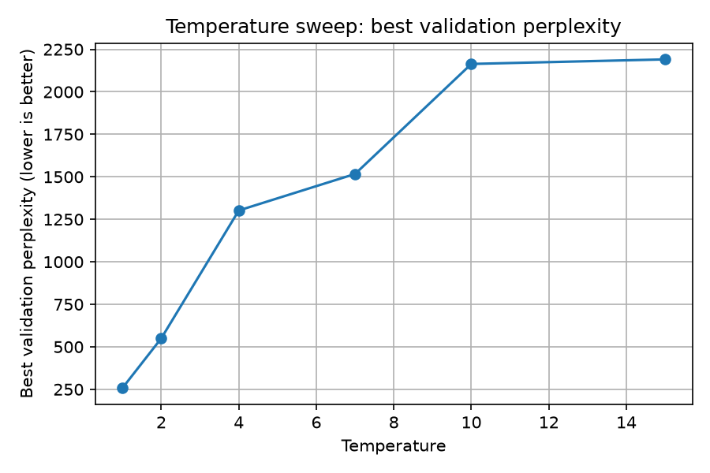
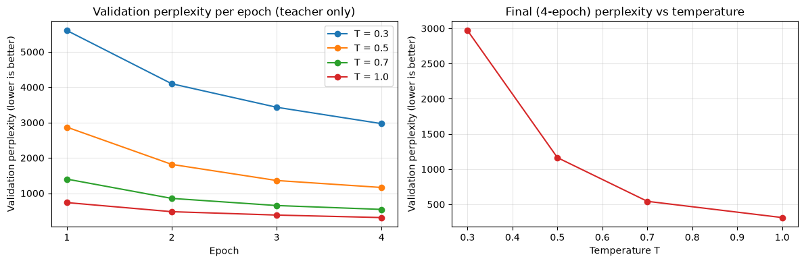
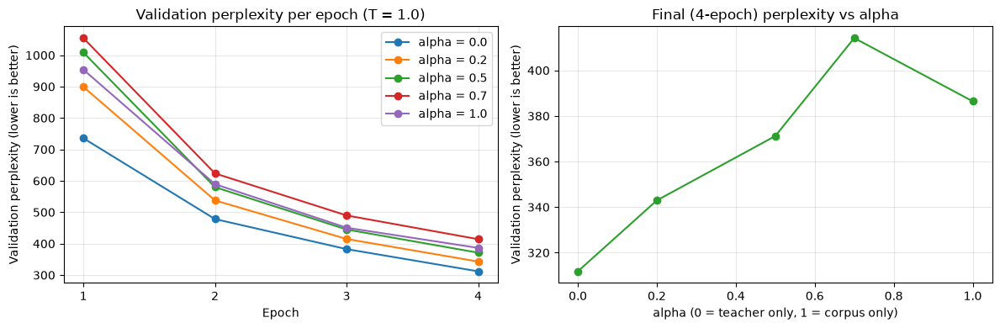

\begin{abstract}
We study how much of GPT-2's ability survives when it is shrunk to a quarter of its size. A pretrained GPT-2 small (124.4M parameters) is the "teacher", and we train a much smaller "student" (30.3M) from scratch on WikiText-2, comparing three losses that differ only in what the student learns from: the real text (corpus only), the teacher's soft predictions (teacher only), or both. Using the teacher helps a lot, roughly halving the test perplexity versus training on the text alone, and the teacher-only student came out best. The student ends up about 4.1$\times$ smaller than the teacher, a quarter of the disk size, and roughly 1.8$\times$ faster to generate, at the cost of higher perplexity.
\end{abstract}

# Attestation of Teamwork

**Yicheng Yao** wrote the loss functions and the training loop. **Jarvis Wang** built the data pipeline, models. **Jiangchuan Yu** ran the experiments, made the figures, and led the writing.

# Introduction

Modern language models work well but are heavy to deploy: slow, memory-hungry, and costly to serve, which is a real problem on a phone, on cheap hardware, or under a tight latency budget. **Knowledge distillation** [1] makes a model smaller without starting over, by training a small *student* to copy a larger *teacher*. What makes it work is that the teacher gives more than the right answer: for each next word it produces a full probability distribution, and even when the top choice is obvious the smaller probabilities are informative. Hinton et al. call this extra signal *dark knowledge*, and a student that learns from it picks up how the teacher generalizes, not just which single word is correct. We apply this idea to GPT-2 small on WikiText-2. The aim is to measure how much of the teacher's language ability transfers into a much smaller student and what we gain in speed and size.

# Preliminaries and Problem Formulation

**Setup.** Let $P_T(\cdot\mid x_{<t})$ and $P_S(\cdot\mid x_{<t})$ be the next-token distributions of the teacher and student given the words so far. The teacher is a frozen GPT-2 small; the student is a smaller model trained from scratch. They share the same GPT-2 tokenizer and the same 1024-token context, because to compare distributions the two models must be talking about the same tokens at the same positions.

**Goal.** Train smaller and faster student models that still perform well on unseen validation and test text, and compare model quality and efficiency.

# Design

**Models.** The teacher is GPT-2 small: 12 layers, hidden size 768, 12 heads, 124.4M parameters. The student keeps the same style but halves both the depth and the width: 6 layers, hidden size 384, 6 heads, 30.3M parameters.

**Parameter count calculation.**

Teacher: embed $(50257+1024)\times 768 \approx 39.4\text{M}$; stack $12\times 12\times 768^2 \approx 85.1\text{M}$; total $\approx 124.4\text{M}$.

Student: embed $(50257+1024)\times 384 \approx 19.7\text{M}$; stack $12\times 6\times 384^2 \approx 10.6\text{M}$; total $\approx 30.3\text{M}$.

The key point is that the two parts shrink at different rates (Appendix A). The embeddings only halve, because their row counts (50,257 tokens, 1024 positions) are fixed by the shared tokenizer and context. The Transformer stack shrinks by $8\times$. So the headline number is only $4.1\times$ even though the part that does the real work is $8\times$ smaller — which will matter for speed.

**Three objectives, one pipeline.** We train three students that are identical in every way (architecture, starting weights, data order) except for the loss. Writing $\mathrm{CE}$ for the cross-entropy against the true next word, the distillation term is
$$
\mathcal{L}_{\text{KD}} = T^2\cdot \mathrm{KL}\big(\,\mathrm{softmax}(z_T/T)\ \|\ \mathrm{softmax}(z_S/T)\,\big),
$$
where $\mathcal{L}_{\text{KD}}$ is the KL-divergence-based knowledge-distillation loss, $z_T$ and $z_S$ are the teacher and student logits, and $T$ is the temperature. The three objectives are:
$$
\text{Corpus only: } \mathcal{L}=\mathrm{CE};\quad
\text{Teacher only: } \mathcal{L}=\mathcal{L}_{\text{KD}};\quad
\text{Teacher + corpus: } \mathcal{L}=\alpha\,\mathrm{CE} + (1-\alpha)\,\mathcal{L}_{\text{KD}},
$$
with $\alpha=0.5$. The pipeline is the same every time: run the batch through the frozen teacher and the student, compute one loss, and update only the student.

**The $T^2$ factor.** For any positive temperature $T$, we define the distillation loss as
$$
\mathcal{L}_{\mathrm{KD}}(T)
=T^2\,
\mathrm{KL}\left(
\mathrm{softmax}(z_T/T)
\,\|\, 
\mathrm{softmax}(z_S/T)
\right).
$$
Writing $p(T)=\mathrm{softmax}(z_S/T)$, $q(T)=\mathrm{softmax}(z_T/T)$, and $\mathcal{L}_{\mathrm{KL}}$ for the same loss without the factor, the student gradient is
$$
\frac{\partial\mathcal{L}_{\mathrm{KL}}}{\partial z_{S,i}}
=\underbrace{\frac{1}{T}}_{\text{chain rule}}\underbrace{\big(p_i(T)-q_i(T)\big)}_{O(1/T)}
=O\!\left(\frac{1}{T^{2}}\right),
\qquad\text{so}\qquad
\frac{\partial\mathcal{L}_{\mathrm{KD}}}{\partial z_{S,i}}
=T\big(p_i(T)-q_i(T)\big)=O(1).
$$
A higher temperature makes this gradient about $T^2$ times smaller, so the teacher would barely update the student at high $T$. Multiplying the loss by $T^2$ undoes this, keeping the teacher signal about the same strength at every temperature.

# Methodology

**Data.** We use `wikitext-2-raw-v1` from Hugging Face (about 2.4M GPT-2 tokens) for everything. We tokenize the text, join it into one long stream, and split it into non-overlapping 1024-token blocks. GPT-2 was not trained or fine-tuned on WikiText-2, so the teacher is tested zero-shot. The students are trained on WikiText-2, which gives them an advantage. A teacher trained on the same data would likely have lower perplexity, so the actual gap between the teacher and students may be larger.

**Training.** Each student is trained with AdamW (`lr = 5e-4`), batch size 16 (16,384 tokens per step), for up to 50 epochs with early stopping (patience 2). After each epoch, we check validation perplexity and save the model weights when it improves. For final testing, we use the weights from the epoch with the lowest validation perplexity, which is the best validation checkpoint. To make the three-way comparison fair, the training function re-seeds itself on entry (seed 42), so all three students see the same starting weights, the same batch order, leaving the loss as the only difference.

**Temperature sweep.** Temperature controls how soft the teacher's distribution is, and the best value depends on the models and data, so we test $T\in\{1,2,4,7,10,15\}$. Each run trains a throwaway student for 5 epochs with the **teacher-only** loss, so temperature is the only thing changing the gradient, and we keep the $T$ with the lowest validation perplexity for the final runs. The short budget only ranks temperatures, so the ranking could shift with longer training.

**Implementation.** PyTorch with Hugging Face `transformers` (`GPT2LMHeadModel`, `GPT2TokenizerFast`) and `datasets`. The KL term uses `F.kl_div` with `reduction = "batchmean"`, which averages over tokens so it sits on the same scale as the mean cross-entropy. Runs used an AMD Radeon PRO W7900 (48 GB, ROCm).

# Numerical Experiments

The settings shared by every run are listed in Appendix B.

**Picking the temperature.** Figure 1 shows the sweep. Under the teacher-only loss, validation perplexity is lowest at $T=1$ and climbs steeply as the temperature goes up, from about 258 at $T=1$ to about 2191 at $T=15$. The curve is basically flat and bad past $T=10$. The reading is that softening the teacher hurts here rather than helps, so we set $T=1$ for the final students. (The absolute numbers are high because each sweep run is short, we only use them to *rank* the temperatures, not as final scores.) We say more about *why* $T=1$ wins in the Discussion.

{ width=50% }

**The main comparison.** Table 1 and Figure 2 report the three students, which share the same architecture, initial weights, data, and settings, so only the loss differs. On validation perplexity the runs separate clearly: Corpus only bottoms out at 214.5 (epoch 13) then worsens, Teacher + corpus reaches 111.2 (epoch 22), and Teacher only keeps improving to 89.4 (epoch 39, the best student, and the circles mark the checkpoint kept for testing). So teacher guidance lets the student train longer before overfitting. The training-loss panel is not comparable across methods, since the three use cross entropy, KL, and a mixture.

Test perplexity tells the same story: GPT-2 29.4, Teacher only 90.7, Teacher + corpus 115.6, and Corpus only far behind at 227.2. Relative to Corpus only, the teacher signal cuts test perplexity by about 49 percent (combined) and 60 percent (teacher only), so the teacher distribution carries information the true next token alone does not. Efficiency is essentially identical across the students, since they share one architecture: about 292–295 tok/s versus 164.6 for GPT-2 ($1.8\times$), 119.1 MB versus 474.7 MB (a quarter), and 30.3M versus 124.4M parameters ($4.1\times$ fewer). The objective changes quality but not inference cost.

\begin{table}[htbp]
\centering
\scriptsize
\begin{tabular}{lrrrrrr}
\toprule
Model & Params (M) & Disk (MB) & Val PPL & Test PPL & Tok/s & Best ep. \\
\midrule
Teacher (GPT-2) & 124.4 & 474.7 & 30.6 & 29.4 & 164.6 & --- \\
Student: Teacher only & 30.3 & 119.1 & \textbf{89.4} & \textbf{90.7} & 292.3 & 39 \\
Student: Teacher + corpus & 30.3 & 119.1 & 111.2 & 115.6 & 295.1 & 22 \\
Student: Corpus only & 30.3 & 119.1 & 214.5 & 227.2 & 294.3 & 13 \\
\bottomrule
\end{tabular}
\caption{Final results}
\end{table}

{ width=100% }

**What the text looks like.** With greedy decoding, the teacher writes fluent sentences while all three 30M students fall into repetition, expected at this size. Still, the teacher-guided students are noticeably less broken than the corpus-only one, which collapses into tight loops (for example, repeating "city" over and over). A couple of transcripts are in Appendix C.

# Temperature and Alpha Experiment

**Background.** During the presentation, two questions came up that the main experiments did not settle. First, we had fixed the blend weight $\alpha=0.5$ without testing other values, so it was unclear how the balance between the corpus and teacher terms affects the student. Second, our temperature sweep only tested $T\ge 1$, so we had not checked whether a *sharper* teacher ($T<1$) could help. To address these points we wrote a small follow-up experiment (`distillation_experiment.ipynb`) and ran it after the main project.

**Setup.** Two one-dimensional sweeps, both on WikiText-2 with the same student and seed, 4 epochs each. The **temperature sweep** trains a teacher-only student (so $\alpha$ plays no role) for $T\in\{0.3, 0.5, 0.7, 1.0\}$. The **alpha sweep** fixes $T=1$ and varies $\alpha\in\{0, 0.2, 0.5, 0.7, 1.0\}$, where $\alpha=0$ is teacher only and $\alpha=1$ is corpus only.

**Temperature results.** Validation perplexity drops sharply as the temperature rises toward 1: 2969.9 at $T=0.3$, 1163.5 at $T=0.5$, 542.6 at $T=0.7$, and 311.7 at $T=1$. Sharpening the teacher is clearly harmful, with $T=0.3$ almost $10\times$ worse than $T=1$. A near one-hot teacher removes the dark knowledge that distillation relies on, leaving a signal little better than a hard label. So the best temperature is at (or above) $T=1$, and going below 1 hurts a lot.

{ width=100% }

**Alpha results.** With $T=1$, validation perplexity is lowest at $\alpha=0$ (teacher only) at 311.8 and rises as more corpus weight is added: 342.9 at $\alpha=0.2$, 371.2 at $\alpha=0.5$, and 414.2 at $\alpha=0.7$, before easing back to 386.4 at $\alpha=1$ (corpus only). Within this short budget the teacher signal alone is the strongest, and mixing in the hard label mostly slows the student down. The curve is not perfectly smooth ($\alpha=0.7$ is the worst point), which is expected from a single seed and only 4 epochs.

{ width=100% }

**What we conclude.** Both sweeps agree with the main results that the teacher signal should dominate. Temperature is best at $T=1$ and should not be pushed below it, and the pure teacher-only objective ($\alpha=0$) gives the best student in this probe. These are short, single-seed runs measured on validation perplexity, so they rank settings rather than give final quality; longer, multi-seed runs would be needed to trust the smaller gaps.

# Discussion

Here we answer the five questions and address points that came up around the presentation.

**Q1 — Does distillation help?** Yes. Both teacher-guided students roughly halve the corpus-only test perplexity (90.7 and 115.6 vs.\ 227.2).

**Q2 — Is the teacher alone enough?** Mostly yes. The teacher-only student was the best of the three, and the alpha sweep agreed that adding corpus weight did not help. We think the small dataset lets hard labels overfit, while the teacher's softer targets are harder to memorize and act like a regularizer [1].

**Q3 — Which temperature is best?** $T=1$. Sharpening the teacher below 1 clearly hurt, since a near one-hot teacher loses the dark knowledge distillation needs. Very high temperatures also fail, because a small student cannot match the teacher's full 50,257-way distribution and is better off getting the top token right [1].

**Q4 — How far behind the teacher?** A fair way behind (90.7 vs.\ 29.4), and the gap is actually *understated*: the teacher is judged zero-shot (it was never trained on WikiText-2) while the students train in-domain, so a teacher fine-tuned on WikiText would look even better. This is unsurprising given the $8\times$ smaller Transformer stack.

**Q5 — What do we gain?** 4.1$\times$ fewer parameters, about 4$\times$ smaller on disk, and about 1.8$\times$ faster generation. The speedup is smaller than the parameter ratio because GPT-2 ties the output layer to the token-embedding table, so every generated token still pays for a projection over all 50,257 tokens (the part that only halved), and at batch size 1 generation is limited by latency, not raw compute.

# Conclusions

Knowledge distillation clearly helped our small GPT-2 student. Both teacher-guided objectives beat plain corpus training by a wide margin, and among the three the teacher-only student was the best. The student is much smaller, lighter on disk, and faster to generate than the teacher, though it still trails the teacher's quality. The teacher-guided students also kept improving for many more epochs before overfitting, which suggests the teacher's soft targets act as a regularizer on this small dataset.

Our follow-up temperature and alpha experiment pointed the same way. Temperature was best at $T=1$, and sharpening the teacher below 1 hurt sharply, because a near one-hot teacher throws away the soft-target information distillation depends on. The alpha sweep found the teacher-only objective strongest, and adding corpus weight did not help, so the teacher signal should dominate the loss. These were short, single-seed probes, so the main limitations remain a single seed and a small dataset. Future work should repeat the runs over several seeds, train longer and on more data such as WikiText-103, add a WikiText-fine-tuned teacher as a fairer upper bound, and test larger students.

# References

[1] G. Hinton, O. Vinyals, and J. Dean. *Distilling the Knowledge in a Neural Network.* arXiv:1503.02531, 2015.

[2] V. Sanh, L. Debut, J. Chaumond, and T. Wolf. *DistilBERT, a distilled version of BERT: smaller, faster, cheaper and lighter.* arXiv:1910.01108, 2019.

[3] J. Kaplan et al. *Scaling Laws for Neural Language Models.* arXiv:2001.08361, 2020.

# Appendix

**A. Parameter breakdown.** How the counts in the Design section split between the embedding tables and the Transformer stack.

: Parameter breakdown (millions).

| Component | Teacher | Student | Ratio |
|---|---:|---:|---:|
| Embedding tables | 39.4 | 19.7 | 2.0$\times$ |
| Transformer stack | 85.1 | 10.6 | 8.0$\times$ |
| **Total** | **124.4** | **30.3** | **4.1$\times$** |

**B. Experimental configuration.** Settings for the main runs and the follow-up sweeps.

: Experimental configuration.

| Setting | Value | Setting | Value |
|---|---|---|---|
| Dataset | wikitext-2-raw-v1 | Optimizer | AdamW, lr 5e-4 |
| Block size | 1024 | Batch size | 16 |
| Teacher | GPT-2 small (124.4M) | Student | 6L / 384 / 6h (30.3M) |
| Seed | 42 | Main epochs / patience | 50 / 2 |
| Main $\alpha$ (combined) | 0.5 | Main $T$ sweep | 1,2,4,7,10,15 (5 ep, teacher-only) |
| Follow-up $T$ sweep | 0.3,0.5,0.7,1 (4 ep, teacher-only) | Follow-up $\alpha$ sweep | 0,0.2,0.5,0.7,1 at $T=1$ (4 ep) |

**C. Sample generations.**

: Representative greedy generations (truncated).

| Prompt / Model | Continuation |
|---|---|
| **"The city was famous for its"** | |
| Teacher | ...high-speed rail system, which was built in the 1930s. The city's first subway was built in the 1930s... |
| Teacher only | ..."greatest and most beautiful and beautiful, but also a great example of the most beautiful..." |
| Teacher + corpus | ...founding in the city of the city of the city of the city of the city... |
| Corpus only | ...city . The city 's city 's city is a city , and the city 's city ... |
| **"Once upon a time in a small village"** | |
| Teacher | ...a young girl named Nana was kidnapped by a group of bandits. She was taken to a small village... |
| Teacher only | ...and the village's the village's had been evacuated to the village. |
| Teacher + corpus | ...of the village of the village of the village... John 's village. |
| Corpus only | ...The first phase of the area of the area of the area of the area... |
